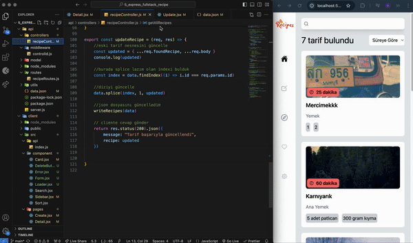

# theScreenGif

# Backend

- nodejs
- express
- nodemon
- cors

# Frontend

- react
- react-router-dom
- axios
- @tanstack/react-query(for api request state menagament)
- react-select
- react-icons
- react-toastify
- tailwind
